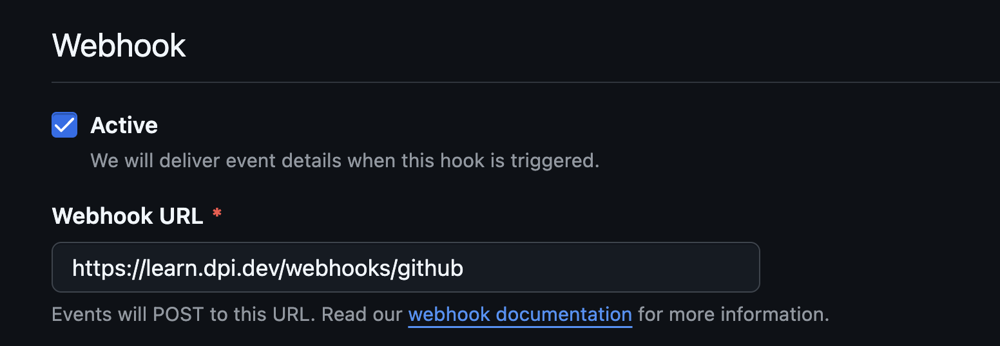
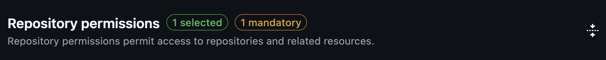
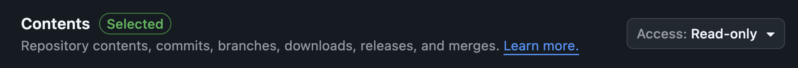
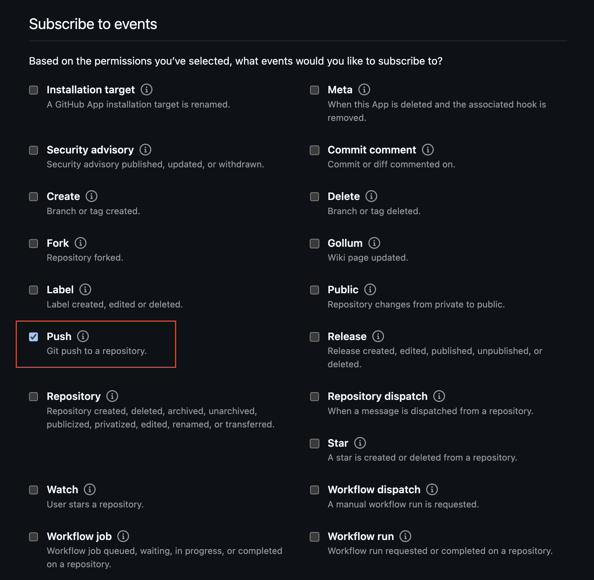
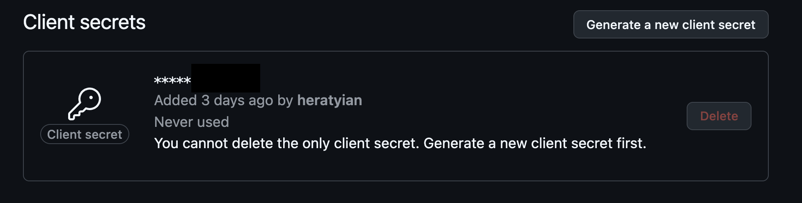

# GitHub App Setup for Rails Webhook Integration

This guide helps you create a GitHub App that sends webhook events (like pushes to the `main` branch) to our `webhooks/github_controller`. We use this to keep lessons in this database synced with GitHub.

## 1. Create a New GitHub App

- Go to the dpi-tta-lessons organization GitHub settings: **→** [https://github.com/organizations/dpi-tta-lessons/settings/apps](https://github.com/organizations/dpi-tta-lessons/settings/apps)
- **→** Click **"New GitHub App"**

Fill in:

- **GitHub App name**: `learn-dpi-dev`
- **Homepage URL**: `https://learn.dpi.dev`
- **Webhook URL**: `https://learn.dpi.dev/webhooks/github` (We can route this to localhost using ngrok or codespaces when testing development)



## 2. Set Permissions

Under **Permissions**, set:

- **Repository permissions** → **Contents** → `Read-only`




## 3. Subscribe to Events

Enable:

- **Push** — "Git push to a repository"



## 4. Set Client Secret

Generate a GitHub Client Secrete and save it in Rails application credentials:

```yaml
github:
  client_secret: 'GITHUB_CLIENT_SECRET'
```



## 5. Install the App

We'll need to make sure this GitHub app is owned by the `dpi-tta-lessons` org.

After saving:

1. Click **Advanced**
2. Transfer ownership of this GitHub App
3. Choose your org (dpi-tta-lessons)

## 6. Webhook Endpoint in Rails

- Expose a POST route to `/webhooks/github`

```ruby
namespace :webhooks do
  resources :github, only: :create
end
```

- Validate the `X-Hub-Signature-256` with the client secret

```ruby
request_body = request.raw_post
signature = "sha256=" + OpenSSL::HMAC.hexdigest(
  OpenSSL::Digest.new("sha256"),
  Rails.application.credentials.dig(:github, :client_secret),
  request_body
)

unless Rack::Utils.secure_compare(signature, request.headers["X-Hub-Signature-256"].to_s)
  Rails.logger.warn("Invalid GitHub webhook signature")
  return head :unauthorized
end
```
